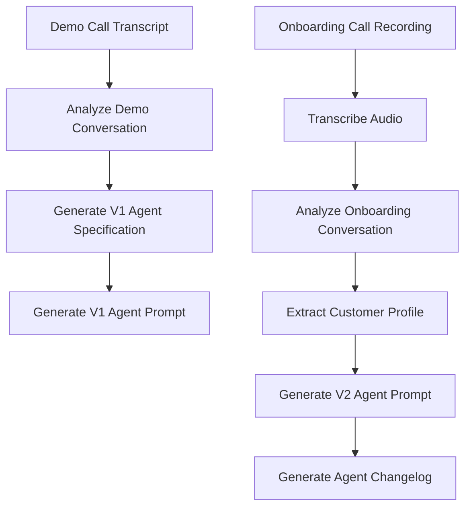

# Clara Agent Automation Pipeline

This project is a zero-cost automation pipeline that generates an AI call answering agent configuration using call recordings and transcripts.

This project aims to simulate how Clara Answers configures voice agents for businesses in the service trade, such as electrical, HVAC, or fire protection businesses, by automatically extracting information from customer calls.

There are two call types that this pipeline processes:

1. **Demo Call** – This call type is used to create an initial agent configuration (V1).
2. **Onboarding Call** – This call type is used to update the agent configuration with actual business information (V2).

This pipeline operates entirely offline using open-source tools, resulting in a structured output that resembles a Retell agent configuration workflow.

---

# Pipeline Overview

## Pipeline Flow



This simulates how an AI call agent evolves from a **generic demo configuration** to a **customer-specific production configuration**.

---

# Project Structure

clara-agent-pipeline
│
├─ dataset
│ ├─ demo_calls
│ │ └─ bens_electric_demo.txt
│ │
│ └─ onboarding_calls
│ ├─ audio1975518882.m4a
│ └─ video1975518882.mp4
│
├─ scripts
│ ├─ analyze_demo_call.py
│ ├─ analyze_onboarding_call.py
│ ├─ gen_agent_prompt.py
│ ├─ gen_v2_agent_prompt.py
│ ├─ gen_agent_changelog.py
│ └─ transcribe_onboarding.py
│
├─ outputs
│ └─ accounts
│ └─ bens-electric
│ ├─ v1
│ │ ├─ v1_agent_prompt.txt
│ │ └─ v1_agent_spec.json
│ │
│ └─ v2
│ ├─ v2_agent_prompt.txt
│ ├─ customer_profile.json
│ ├─ agent_changelog.txt
│ └─ onboarding_transcript.txt
│
├─ pipeline_runner.py
├─ requirements.txt
└─ README.md

Outputs are versioned so that changes between **V1 and V2 agents** are clearly visible.

---

# Setup Instructions
### 1. Clone the repository
```
git clone https://github.com/skill-maxxer/clara-ai-agent-pipeline.git
cd clara-agent-pipeline
```
### 2. Create and activate a virtual environment
```
python -m venv venv
```
Windows:
```
venv\Scripts\activate
```
Mac/Linux:
```
source venv/bin/activate
```
### 3. Install dependencies
```
pip install -r requirements.txt
```

---

# Running the Pipeline

To run the full automation pipeline:
```
python pipeline_runner.py
```

The pipeline will automatically execute:

1. Demo call analysis  
2. V1 agent generation  
3. Onboarding call transcription  
4. Onboarding analysis  
5. V2 agent generation  
6. Agent changelog generation  

All outputs will be written to the **outputs/accounts/** directory.

---

# Output Files

### V1 Agent

Generated from the demo call:
```
v1_agent_spec.json
v1_agent_prompt.txt
```

These represent the **initial draft configuration** of the Clara agent.

---

### V2 Agent

Generated after processing the onboarding call:
```
v2_agent_prompt.txt
customer_profile.json
agent_changelog.txt
```

These contain:

- customer business rules
- pricing policies
- working hours
- operational updates
- differences between V1 and V2

---

# Zero-Cost Tools Used

This project was designed to run entirely with free tools:

- **Python**
- **OpenAI Whisper (local model)** for audio transcription
- **Regex + basic NLP heuristics** for extracting information
- **JSON prompt templating**
- **Local scripts for pipeline automation**

No paid APIs or external services were required.

---

# Notes

This implementation is focused on the creation of **a simple, reproducible automation pipeline** rather than a production-grade NLP system. The idea was to demonstrate system design, automation thinking, and the ability to extract structured information from actual conversations.

The pipeline is designed to be simple enough to extend to multiple demo/onboarding call pairs.

---